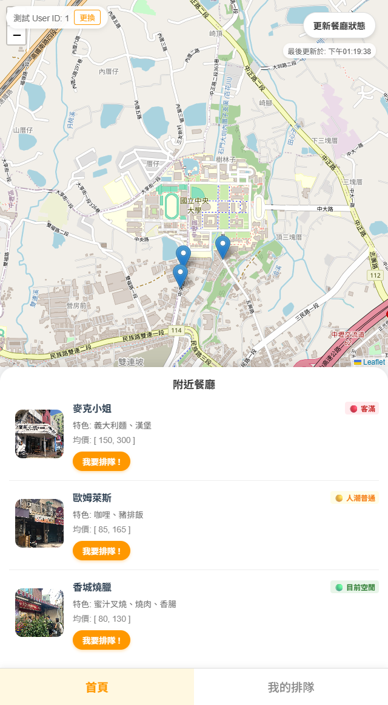
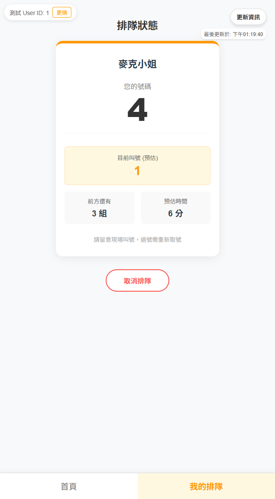
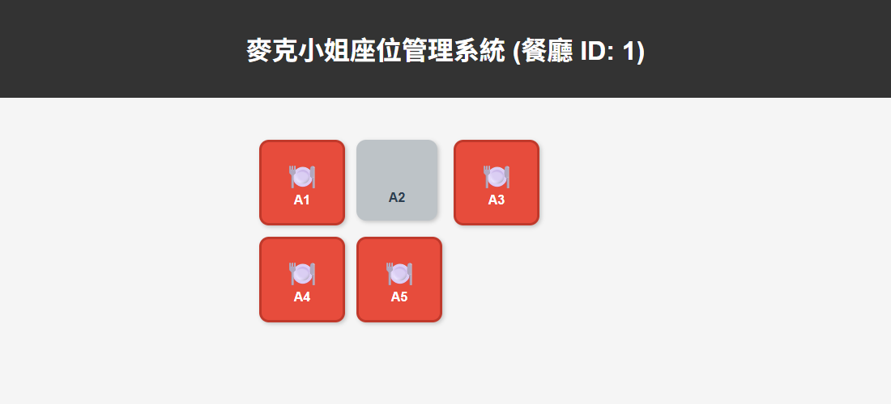

# CentralSeat

**中央大學周邊餐廳候位與座位管理系統**

CentralSeat 是計算機網路課程專案，以中央大學周邊餐廳為展示情境，串接顧客端的餐廳地圖、線上取號與排隊查詢，以及店家端的帶位、清桌與座位管理。

[環境設定與本機啟動](SetUp_Guide.md) · [開發規範與 Git 協作](docs/DEVELOPMENT.md) · [系統架構](architecture.md)

## 功能介紹

| 功能 | 說明 |
| --- | --- |
| 餐廳地圖與列表 | 在 OpenStreetMap 地圖查看餐廳位置，點選標記可連動餐廳卡片；列表提供圖片、餐點特色、價格區間與人潮狀態。 |
| 餐廳狀態查詢 | 依剩餘桌數與等候組數顯示「目前空閒／人潮普通／客滿」，可手動更新。 |
| 線上取號 | 取號前查看等待組數與預計時間，確認後取得號碼牌；同一位使用者只能加入一個隊伍。 |
| 我的排隊 | 查看自己的號碼、前方等待組數、預估叫號與等待時間，並可更新資訊或取消排隊。 |
| 店家座位管理 | 以座位圖區分空桌與用餐中的桌位；點選空桌可確認下一組客人入座，點選用餐中的桌位可確認清桌。 |
| 多人情境測試 | 顧客端提供測試 User ID，可在不同分頁使用不同 ID 模擬多人排隊。 |

## 畫面預覽

以下畫面使用專案內建的模擬餐廳資料與測試 User ID。

| 餐廳地圖與列表 | 我的排隊 |
| :---: | :---: |
|  |  |
| 瀏覽餐廳位置、特色與人潮狀態，從餐廳卡片開始取號。 | 查看號碼牌、前方等待組數與預估時間，也能取消排隊。 |

地圖資料：[© OpenStreetMap contributors](https://www.openstreetmap.org/copyright)。

### 店家座位管理

灰色代表空桌，紅色代表用餐中；店家可透過點選桌位進行帶位與清桌。



## 操作流程

1. 在顧客端輸入正整數的測試 User ID，進入餐廳地圖。
2. 選擇餐廳並點選「我要排隊 !」，確認等待資訊後取號。
3. 前往「我的排隊」查看進度，使用「更新資訊」取得最新狀態。
4. 店家開啟對應餐廳的座位管理頁，點選空桌並確認下一組客人入座；客人離席後再點選桌位清桌。

完成[環境設定](SetUp_Guide.md)並啟動前後端後，可使用以下入口：

| 入口 | 本機網址 |
| --- | --- |
| 顧客端首頁 | <http://localhost:5173/> |
| 我的排隊 | <http://localhost:5173/queue> |
| 店家座位管理（餐廳 1） | <http://localhost:5173/restaurant/1/table> |
| 後端 API 文件（Swagger UI） | <http://localhost:8000/docs> |

店家網址中的餐廳 ID 可替換為 `1`、`2` 或 `3`，分別對應麥克小姐、歐姆萊斯與香城燒臘。

## 技術組成

| 層級 | 技術 |
| --- | --- |
| 前端 | Vue 3、TypeScript、Vite、Vue Router、Pinia |
| 地圖 | Leaflet、Vue Leaflet、OpenStreetMap |
| 後端 | Python、FastAPI、Pydantic、Uvicorn |
| 前後端通訊 | HTTP API，以 JSON 交換資料 |
| 展示資料 | 記憶體內的模擬 Repository |
| 測試工具 | pytest、Vitest |

目前提供本機展示模式：排隊與桌位資料保存在記憶體中，後端重啟後會重置；顧客身分使用測試 User ID。前端 API 位址預設為 `http://localhost:8000`，部署至其他主機時需調整 API／圖片位址與後端 CORS 設定。

## 專案結構

```text
.
├── frontend/               # Vue 顧客端與店家端
│   └── src/
│       ├── views/          # 餐廳地圖、排隊頁面與版面配置
│       ├── components/     # 地圖標記、座位圖
│       ├── services/       # HTTP API 呼叫
│       └── stores/         # 測試使用者等前端狀態
├── backend/
│   ├── app/
│   │   ├── routers/        # API 路由
│   │   ├── services/       # 排隊、餐廳狀態與桌位邏輯
│   │   ├── interfaces/     # Service 與 Repository 介面
│   │   ├── repositories/   # 資料存取與記憶體模擬資料
│   │   ├── domain/         # 領域模型與錯誤定義
│   │   ├── schemas/        # API 資料格式
│   │   └── imgs/           # 餐廳圖片
│   └── tests/              # 後端測試
├── docs/
│   ├── DEVELOPMENT.md      # 原 README：開發流程與 Git 協作
│   └── images/             # 首頁功能截圖
├── img/                    # Git 教學圖片
├── SetUp_Guide.md           # 環境設定與本機啟動
└── architecture.md         # 系統架構圖
```
