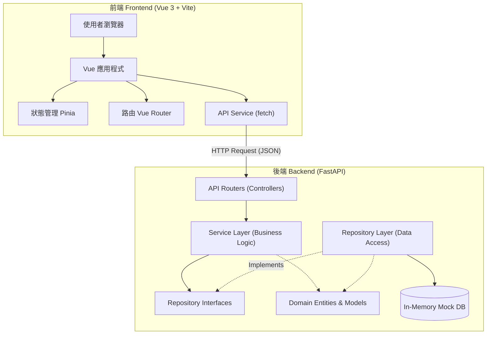

# CentralSeat 系統架構

[回到專案首頁](README.md) · [環境設定與本機啟動](SetUp_Guide.md)

```mermaid
graph TD
    subgraph Client ["前端 Frontend (Vue 3 + Vite)"]
        Browser[使用者瀏覽器]
        VueApp[Vue 應用程式]
        Pinia[狀態管理 Pinia]
        Router[路由 Vue Router]
        APIService["API Service (fetch)"]
        
        Browser --> VueApp
        VueApp --> Router
        VueApp --> Pinia
        VueApp --> APIService
    end

    subgraph Server ["後端 Backend (FastAPI)"]
        APIRouter["API Routers (Controllers)"]
        ServiceLayer["Service Layer (Business Logic)"]
        RepoInterface[Repository Interfaces]
        RepoLayer["Repository Layer (Data Access)"]
        Domain[Domain Entities & Models]
        
        APIService -- "HTTP Request (JSON)" --> APIRouter
        APIRouter --> ServiceLayer
        ServiceLayer --> RepoInterface
        RepoLayer -.->|Implements| RepoInterface
        RepoLayer --> MockDB[(In-Memory Mock DB)]
        
        ServiceLayer -.-> Domain
        RepoLayer -.-> Domain
    end
```
